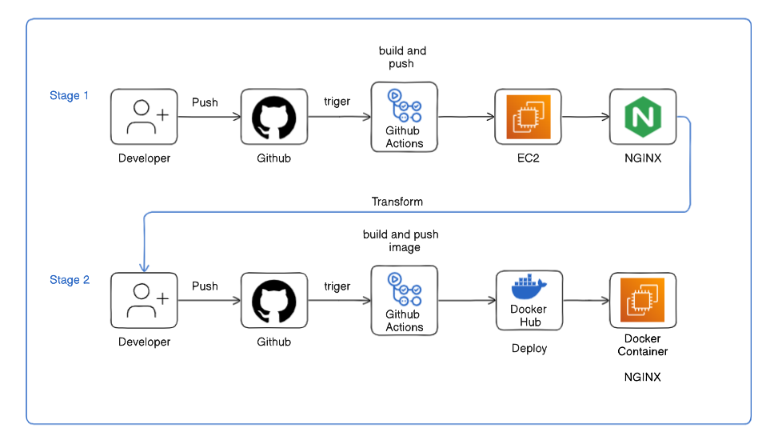

# cicd-static-site-project
## Static Website CI/CD Pipeline

## Project Overview

This project demonstrates how to build and deploy a static website (index.html) using a complete CI/CD pipeline powered by GitHub Actions, Docker, and AWS EC2 (Ubuntu with Nginx).

It showcases skills in:

- CI/CD with GitHub Actions
- Docker image creation and publishing
- Automated deployment to AWS EC2
- Nginx web hosting on Ubuntu
- Infrastructure automation & cloud engineering best practices

## ⚙Tech Stack

Frontend: HTML5, CSS3 (Responsive Design)
Containerization: Docker & Docker Hub
CI/CD: GitHub Actions
Cloud Hosting: AWS EC2 (Ubuntu 22.04)

Web Server: Nginx

## Project Structure & Architechture

## CI/CD Workflow

Push Code → When code is pushed to main, GitHub Actions is triggered.

Build & Push Docker Image → The pipeline builds a Docker image containing the static site and pushes it to Docker Hub.

Deploy to AWS EC2 → Workflow connects to the EC2 instance via SSH, pulls the latest Docker image, and runs the container behind Nginx.

Serve Website → Nginx hosts the containerized static website on EC2, accessible via the public IP or domain.

## Docker Setup

The Dockerfile packages the static index.html inside an Nginx container:

FROM nginx:alpine
COPY index.html /usr/share/nginx/html/

## Deployment Steps

GitHub Actions builds & pushes the Docker image to Docker Hub

EC2 pulls the image and runs the container

Nginx serves the updated website

## Key Takeaways

-Built a production-ready CI/CD pipeline with GitHub Actions
-Automated deployments to AWS EC2 with Nginx
-Showcased knowledge of DevOps, cloud, and containerization
-Designed a scalable and maintainable portfolio project for recruiters

## Demo

👉 Linkdin Link: https://www.linkedin.com/posts/george-arthur-467151295_build-an-automated-cicd-deployment-activity-7365123264873951232-0iiI?utm_source=share&utm_medium=member_desktop&rcm=ACoAAEdj-k8BuuVlzbSzAuXFJ3V4qjJ5ijI51mI

## Future Improvements

Add HTTPS with Let’s Encrypt
Extend site with CSS/JS assets
Use Terraform to automate EC2 + networking
